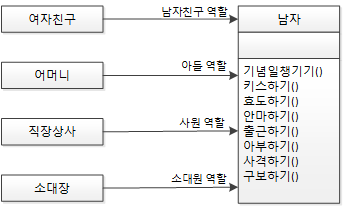

# 5. 객체 지향 설계 5원칙 - SOLID

## SOLID

- `SRP` : 단일 책임 원칙
- `OCP` : 개방 폐쇄 원칙
- `LSP` : 리스코프 치환 원칙
- `ISP` : 인터페이스 분리 원칙
- `DIP` : 의존 역전 원칙

<aside>
💡

고전 원칙 : 응집도는 높이고 결합도는 낮춰라!

</aside>

- SOLID는 객체 지향 프로그램을 구성하는 속성, 메서드, 클래스, 객체, 패키지, 모듈 등등 다양한 곳에 다양하게 적영된다.
- 우리는 SW에 SOLID를 녹여내야한다. → 스프링 프레임워크의 근간이다.

---

## SRP - 단일 책임 원칙

<aside>
💡

어떤 클래스를 변경해야 하는 이유는 오직 하나뿐이여야 한다.

</aside>

- 위와 같이 남자 클래스에 의존하는 다양한 클래스가 존재
    - 어느날 여자친구와 헤어졌다고 하면 키스를 할 대상이 사라지게 된다.
    - 이런 경우에 역할(책임)을 분리하라는 것이 **단일 책임 원칙**

- 클래스를 역할과 책임에 따라 분리해서 각각 하나의 역할과 책임을 갖게함.
    - 속성, 메서드, 패키지, 모듈, 컴포넌트, 프레임워크 등에도 적용이 가능함

---

## OCP - 개방 폐쇄 원칙

<aside>
💡

소프트웨어 엔티티(클래스, 모듈, 함수 등)는 확장에 대해서는 열려있어야 하지만, 변경에 대해서는 닫혀 있어야 한다.

</aside>

- 한 운전자가 마티즈를 구입하고, 훗날 소나타가 생김
    - 기어가 수동이던 마티즈에서 자동인 쏘나타로 차종을 바꾸니 행동에 변화가 생긴다. → 운전 습관을 바꿔야할까?
    
    
    
- 객체 지향에서는 **상위 클래스  or 인터페이스**를 두는 것으로 해결한다
    - 다양한 자동차가 생긴다고 해도 객체지향 세계의 운전자는 영향을 받지 않게 된다.
        - 운전자의 입장에서는 주변의 변화에 영향 x
        - 자동차의 입장에선 자신의 확장에 개방되어 있음

---

## LSP - 리스코프 치환 원칙

<aside>
💡

서브 타입은 언제나 자신의 기반 타입으로 교체할 수 있어야 한다.

</aside>

- 객체 지향에서의 상속은 조직도, 계층도가 아닌 분류도가 되어야 한다.
    - 하위 클래스 is a kind of 상위 클래스 - 하위 분류는 상위 분류의 한 종류다.
    - 구현 클래스 is able to 인터페이스 - 구현 분류는 인터페이스할 수 있어야 한다.

### 잘못된 상속 예시

- 아버지를 상위 클래스로 하는 딸 하위 클래스가 있다고 하자.
    - 전형적인 계층도 계층 → 객체지향의 상속을 잘못 적용한 경우. → 뭐가 문제일까?
    - 상위 클래스의 객체 참조 변수에는 하위 클래스의 인스턴스를 할당할 수 있다.
    
    <aside>
    💡
    
    아버지 춘향이 = new 딸()
    
    - 동물 뽀로로 = new 펭귄()
    </aside>
    
    - 딸을 낳아서 이름을 붙인건 좋은데 **아빠의 역할까지 딸에게 맡기고 있다.**
    - 아래의 펭귄 같은 경우는 분류도 형태 → 논리적으로 아무런 이상이 없음.
    
    
    
- 계층도/조직도(족보) VS 분류도
    - 분류도의 경우 하위 존재가 상위 존재의 역할을 하는 데 전혀 문제가 없다.
    - 상속을 올바르게 사용하자

---

## ISP - 인터페이스 분리 원칙

<aside>
💡

클라이언트는 자신이 사용하지 않는 메서드에 의존 관계를 맺으면 안된다.

</aside>

- SRP를 설명할때 예를 들었던 남자 클래스를 보면 결국 잘게잘게 분리하는거 밖에 정답이 없나? 라는 생각이 든다면 ISP를 선택할 수 있다.

- 남자 클래스를 책임과 역할에 따라 클래스를 쪼개는 것이 아님
    - **필요한 경우에 필요한 역할만 할 수 있게 인터페이스로 제한하는 것**
- 근데 무조건 하나가 맞다가 아니라 상황에 맞게 SRP, ISP를 선택해서 설계할 것
    - 특별한 경우가 아니라면 SRP가 더 좋은 해결책
- ISP는 인터페이스 최소주의 원칙을 가짐
    - 인터페이스를 통해 외부에 메서드를 제공 시 최소한의 메서드만 제공해야함.

<aside>
💡

**상위 클래스는 풍성할수록 좋고, 인터페이스는 작을수록 좋음**

</aside>

---

## DIP - 의존 역전 원칙

<aside>
💡

**추상화된 것은 구체적인 것에 의존하면 안된다 → 구체적인 것이 의존해야함**

**자주 변경되는 구체 클래스에 의존하지 마라**

</aside>

- 자동차와 스노우타이어 사이에는 의존 관계가 있음
    - 계절이 지나면 타이어는 스노우타이어로 교체해야함
        - 그냥 교체 시 영향에 노출되어 있음
        
        
        
- 타이어 인터페이스에 의존하게 바꾼다면 인터페이스의 구현체가 변경되어도 자동차는 그 영향을 받지 않는다. → OCP도 녹아들어 있음.
    - 하나의 해결책에 여러 설계를 찾을 수 있음

### 의존 역전

- 스노우 타이어는 무엇에도 의존하지 않는 클래스 였는데
    - 타이어 인터페이스에 의존하게 바뀜
- 중간에 추상화된 타이어 인터페이스를 추가해 두고 의존 관계를 역전시킴